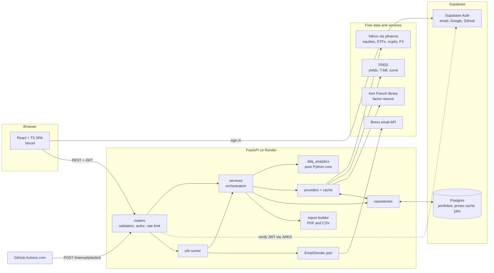
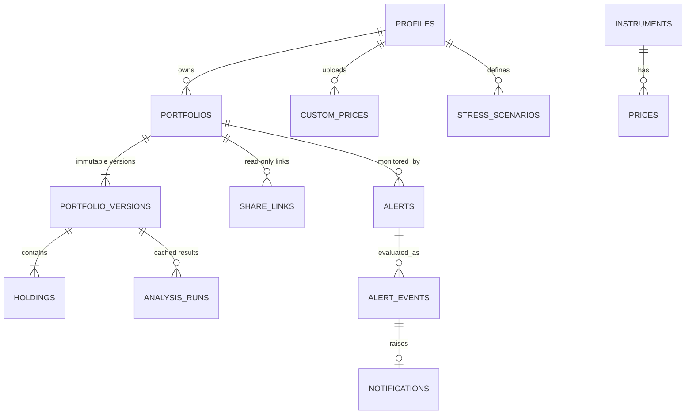

# DDQ Portfolio Dashboard: Project Plan

**DDQ = Data Driven Quant.** Repo slug: `ddq-portfolio-dashboard`.
**Status:** v0.1, awaiting your approval. No code has been written and nothing has been scaffolded.

---

## 1. Shared understanding

**Goal.** A public portfolio project that gets you interviews for risk analyst, quant, data analyst and software engineer roles at finance firms and tech companies. It has to show two things. The methodology is defensible: you can explain every number and its limits. The engineering is production quality: tests, CI, security, deployment.

**Success looks like:**
- A live demo URL a recruiter can use in 30 seconds *without signing up*.
- A public repo with a README (setup, screenshots, methodology, limitations, architecture).
- Analytics core with 80%+ coverage, validated against reference implementations and synthetic data with known answers.
- Every metric has a methodology note you can recite in an interview.

**From your brief (fixed):** stack, data sources, asset classes, defaults (5y, SPY, USD), auth methods, persistence and versioning, all listed risk features, the optional C++ engine, phased delivery, tests-first, CI, no time estimates.

**My assumptions (please correct any that are wrong):**
1. "Live demo" must be usable by a visitor with no account, so I add a seeded **demo portfolio** and a guest **ad-hoc analysis** mode. Without this the demo is a login wall.
2. Everything runs on free tiers, so free-tier limits (sleep, memory, pausing) are design constraints, not afterthoughts (section 12).
3. The analytics core (`ddq_analytics`) is a standalone Python package: no FastAPI, no DB, no network. You can `pip install` it and use it in a notebook.
4. Portfolio risk is computed from **current holdings held at constant weights** (historical simulation). It is not a P&L replay of trades you actually made. This is the industry-standard simplification and is stated on the methodology page.

---

## 2. Decisions I made (veto any of these)

| # | Decision | Why | Alternative rejected |
|---|----------|-----|----------------------|
| D1 | **Auth = Supabase Auth** (email/password, Google, GitHub). The SPA signs in with `supabase-js`. FastAPI only *verifies* the JWT (JWKS, audience, expiry). | You never store passwords or hand-roll OAuth. "Secure auth" is met by a vetted provider. Free tier covers it. | Rolling my own with Authlib + argon2: more to defend, more risk, no upside. |
| D2 | **API host = Render** (Docker web service, free). | Fly.io no longer has a free tier for new accounts (verify in Phase 0). | Fly.io. |
| D3 | **Background jobs = a Postgres `jobs` table** claimed with `FOR UPDATE SKIP LOCKED`, ticked by a **GitHub Actions cron** hitting a secret-protected `/internal/jobs/tick`. | Render free has no worker or cron. This is a small, real queue design (retries, dedupe, idempotency) and shows SQL skill. | Celery/Redis: paid infra. Supabase `pg_cron`: fine but less visible in the repo. |
| D4 | **Email = Brevo free tier** behind an `EmailSender` port. | Resend's free tier only sends to unverified recipients from a verified domain, which needs a domain you may not own. Brevo needs only a verified sender address. | Resend, if you own a domain: one-adapter swap. |
| D5 | **Charts = Apache ECharts** (tree-shaken). | Heatmaps, zoomable time series, fan charts, dark theme, all first-class. | Plotly (huge bundle), Recharts (weak heatmap and fan charts). |
| D6 | **DB access = SQLAlchemy 2 (async) + Alembic**. FastAPI is the *only* DB client. RLS is enabled deny-all on every table so the public Supabase REST endpoint cannot be used to bypass the API. | One authorization surface, testable in Python. Defense in depth. | Letting the SPA query Supabase directly: authorization scattered across policies. |
| D7 | **PDF = ReportLab + matplotlib** (pure pip). | No system libraries; fits the free-tier memory budget. | WeasyPrint (needs Pango). |
| D8 | **Regression/optimizer = numpy/scipy only**; no statsmodels, scikit-learn or cvxpy in production dependencies. Those go in *dev* dependencies as **test oracles**. | The API must fit in 512 MB RAM. Implementing OLS+Newey-West, Ledoit-Wolf and SLSQP frontiers myself and testing against the libraries is also better interview material. | Shipping the heavy libraries. |
| D9 | **Contract-first types**: TS types are generated from FastAPI's OpenAPI schema; CI fails on drift. | Removes a whole class of frontend/backend bugs. | Hand-written duplicate types. |
| D10 | **Monorepo**: `packages/analytics`, `apps/api`, `apps/web`, `native/mc_engine`. | One repo to show, one CI, clean dependency direction. | Multi-repo. |

---

## 3. Architecture



**Dependency rule (enforced by an import-linter check in CI):**
`routers → services → {analytics, providers, repositories}`. `ddq_analytics` imports nothing from `apps/`. It takes DataFrames in and returns frozen dataclasses out.

**Request flow for a dashboard load:** router validates and authorizes → service loads holdings → providers return aligned prices from the Postgres cache (fetching from the source only on a miss or stale entry) → service builds the returns matrix → `ddq_analytics` computes → service caches the result in `analysis_runs` keyed by (portfolio version, params hash, data snapshot hash) → response envelope.

### Repo layout

```
ddq-portfolio-dashboard/
├─ packages/analytics/          # ddq_analytics: pure, no I/O
│  ├─ src/ddq_analytics/
│  │   returns.py  performance.py  covariance.py  var.py  cvar.py
│  │   risk_contribution.py  concentration.py  benchmark.py  rolling.py
│  │   montecarlo.py  stress.py  optimize.py  factors.py
│  │   backtest.py  whatif.py  quality.py  types.py
│  └─ tests/
├─ apps/api/
│  ├─ src/ddq_api/  routers/ services/ repositories/ providers/ jobs/ auth/ reports/ core/
│  ├─ migrations/               # Alembic
│  └─ tests/
├─ apps/web/                    # Vite + React + TS
├─ native/mc_engine/            # C++ + pybind11 (Phase 9, optional)
├─ docs/  PLAN.md  architecture.md  methodology/*.md  adr/*.md
├─ .github/workflows/
└─ README.md
```

Every file targets 200–400 lines, 800 max. Analytics modules are one metric family per file.

---

## 4. Analytics core: conventions that make numbers defensible

These conventions are documented once on the methodology page and referenced by every metric.

| Topic | Convention | Limit to state honestly |
|-------|------------|--------------------------|
| **Prices** | Adjusted close (splits and dividends reinvested), so returns are *total return*. Crypto and FX have no adjustments. | Yahoo's adjustments are occasionally wrong; the data-quality report flags return outliers. |
| **Returns** | Daily **simple** returns. Portfolio return = Σ wᵢrᵢ (simple returns aggregate linearly across assets). Log returns only where time-additivity matters (Monte Carlo drift). | Simple returns aren't time-additive; cumulative return is compounded. |
| **Calendar** | The **benchmark's trading calendar is master**. Other assets are sampled on those dates, last observation carried forward for at most 5 days. Crypto's Fri→Mon return is a 3-day return. Annualization uses 252. | LOCF on foreign holidays creates zero returns and lag, which biases correlation down (asynchronous-close effect). Reported per asset. |
| **Currency** | Each asset is converted to base currency: `price_base = price_local × fx(local→base)`. Returns therefore include FX return. FX pairs are ordinary series. | Assumes the position is **unhedged**. Base-currency risk-free rate is only available for USD (see below). |
| **Weights** | Holdings given as quantities are converted to weights at the latest price; weights given directly are used as is. Constant weights (daily rebalanced) across history. | Real portfolios drift; this is "current-exposure risk". |
| **Risk-free** | FRED 3-month T-bill (DTB3) → daily rate. For non-USD base the user sets a constant. | A single rate for the whole window. |
| **Sign** | VaR/CVaR are reported as **positive losses**, as a fraction and in base currency. | — |
| **Confidence / horizon** | 95% and 99%, 1-day default, 10-day option. Parametric scales by √h; historical uses overlapping h-day windows. | √h scaling assumes i.i.d.; overlapping windows are autocorrelated. |
| **Immutability** | Analytics inputs are never mutated (tested: input frame hash unchanged). Outputs are `@dataclass(frozen=True)` or frozen Pydantic models. | — |

### Metric catalogue

| Metric | Method | Key assumption / limitation to document |
|--------|--------|------------------------------------------|
| Return, volatility | Annualized geometric return; σ·√252 | Vol is backward-looking. |
| Sharpe / Sortino | Excess over rf; Sortino uses downside deviation vs MAR=0 (definition written out) | Sharpe penalizes upside; both assume stable distribution. |
| Max drawdown | On the wealth index; also duration and recovery | Path-dependent, sample-specific. |
| Beta / alpha / TE / IR / capture | OLS vs benchmark; Jensen's alpha | Beta unstable; single-factor. |
| Correlation & covariance | Sample matrix, plus **Ledoit-Wolf shrinkage** (implemented in numpy, tested against scikit-learn) | Sample covariance is noisy when assets ≈ observations. PSD check and repair. |
| Historical VaR | Empirical quantile of portfolio returns | Needs a long window; ignores the future. |
| Parametric VaR | Normal with sample μ, Σ; optional **EWMA (λ=0.94)** volatility | Normality understates tails; EWMA reacts faster. |
| CVaR / ES | Historical tail mean; parametric closed form φ(z)/(1−α)·σ | Tail estimate rests on few observations. |
| Risk contribution | Euler decomposition: component vol, component VaR (parametric), component ES (historical, tail-conditional) | Sums to portfolio total; that's the test. |
| Concentration | HHI, effective N = 1/HHI, top-N weight, **risk-based** HHI and effective N from risk contributions | Weight concentration ≠ risk concentration; showing both is the point. |
| Monte Carlo | Correlated paths via Cholesky (eigenvalue clipping if not PSD). Engines: multivariate normal, multivariate Student-t, historical bootstrap. Seeded RNG. Reports standard error of the estimate. | Normal understates tails; parameters are estimated with error. |
| Stress tests | Historical replay (GFC 2008, COVID 2020, rate shock 2022) and custom shocks (per asset, per asset class, rate shift in bp via duration, FX move) | See stress note below. |
| Optimization | Min-variance, max-Sharpe, efficient frontier. Long-only, sum-to-1, optional weight caps, up to 30 assets. SLSQP. Ledoit-Wolf Σ. | Mean estimates are noisy (Michaud's "error maximizer"), so I add an optional out-of-sample check: optimize on the first half of history, evaluate on the second. |
| Factor exposure | Fama-French 3/5 factors + momentum from Ken French's library. OLS with Newey-West HAC errors. Report loadings, t-stats, R², annualized alpha. | US equity factors; low R² for crypto and bonds (shown, with a warning); factor data lags by weeks. |
| VaR backtest | Rolling 250-day VaR forecast vs realized next-day P&L. **Kupiec POF** (unconditional coverage), plus **Christoffersen independence and conditional coverage**, plus Basel traffic-light zone | Kupiec alone can't see exception clustering. That's why Christoffersen is included. |
| What-if | Re-run the same pipeline with an added or removed position; show a delta table (vol, VaR, CVaR, effective N, top contributor) | Ex-ante estimate only. |

**Stress note (important):** a 5-year default window contains neither 2008 nor Feb–Mar 2020. Historical scenarios therefore use a **separate longer history pull** for the scenario window. Holdings with no data in that window (e.g. an ETF launched in 2015) are mapped to a documented **proxy** (asset-class proxy scaled by beta) and the result reports *what percentage of portfolio weight was covered by real data vs proxy*. Bond-ETF rate shocks use effective durations from a versioned config file with an as-of date.

### Validation strategy (how you prove the numbers are right)
1. **Known-answer tests:** hand-computed small cases, checked into tests with the arithmetic shown.
2. **Reference oracles (dev-only):** compare against scipy, statsmodels (OLS/HAC) and scikit-learn (Ledoit-Wolf) within tolerance.
3. **Synthetic data with a known truth:** simulate returns from a known normal → parametric VaR must pass Kupiec at ~α; simulate fat-tailed data → parametric VaR must *fail* and Student-t Monte Carlo must pass. This is a strong interview story.
4. **Property-based tests (hypothesis):** VaR monotone in confidence, CVaR ≥ VaR, risk contributions sum to total, weights sum to 1, correlation matrix symmetric with a unit diagonal.
5. **Golden files** for seeded Monte Carlo.

---

## 5. Data layer design

**Provider port:** `MarketDataProvider.fetch(symbol, start, end) → PriceSeries`. Adapters:

| Adapter | Serves | Notes |
|---------|--------|-------|
| `YahooProvider` (yfinance) | equities, ETFs, crypto (`BTC-USD`), FX (`EURUSD=X`) | Unofficial and fragile, so everything goes through the cache and the resilience layer. |
| `FredProvider` | DTB3, DGS yield-curve series, other rates | Free API key from you. |
| `FrenchLibraryProvider` | Fama-French + momentum daily CSV zips | Public files, no key. |
| `CryptoFallbackProvider` (Kraken or CoinGecko) | crypto if Yahoo fails | Small; exists to demonstrate the fallback design. |
| `CsvProvider` | user-uploaded prices, namespaced per owner (`csv:SYMBOL`) | Never mixed into the shared cache. |

**Resilience:** Postgres cache with per-symbol coverage records and refresh policy (stale if the last expected trading day is missing and >N hours since fetch); token-bucket rate limiting per provider; retry with exponential backoff and jitter; circuit breaker; **single-flight** per symbol (Postgres advisory lock) so concurrent requests don't stampede; **stale-while-error** (serve cached data with a visible "stale since…" flag).

**Input safety:** ticker allowlist regex (`^[A-Z0-9.\-=^]{1,15}$`) because symbols reach third-party URLs. Max 30 holdings per portfolio, bounded date ranges.

**Corporate actions and missing data:** adjusted prices handle splits/dividends; the pipeline flags return outliers (>5σ or >40% daily), stale runs (identical price for N days), gaps, and short histories. Assets with too little history are excluded from the common window *or* the window is truncated, and the user is told which.

**Data-quality report (per portfolio version):** per-asset coverage %, first/last date, gaps filled (count and longest), stale-run count, outlier-return dates, FX conversions applied, calendar mismatches, the window actually used (and which asset limited it), data sources and fetch timestamps. A headline score with the reasons, not just a number.

**Bonds:** documented proxies: AGG, BND, TLT, IEF, SHY, LQD, HYG, plus FRED yield curve (DGS1MO…DGS30) for the curve chart and rate-shock stress.

**Data licensing:** market data is cached in the database, *not committed to the repo*, and the UI shows source attribution and "educational, not investment advice".

---

## 6. Data model



| Table | Key columns | Notes |
|-------|-------------|-------|
| `profiles` | `user_id` (→ `auth.users`), `email`, `created_at` | Minimal; no passwords here. |
| `portfolios` | `id`, `owner_id`, `name`, `latest_version_no`, timestamps | |
| `portfolio_versions` | `id`, `portfolio_id`, `version_no`, `base_currency`, `benchmark_symbol`, `lookback_years`, `note`, `created_at`; unique(`portfolio_id`,`version_no`) | **Immutable.** An "edit" inserts a new version. This is the immutability pattern applied to persistence, and it makes versioning and comparison trivial. |
| `holdings` | `version_id`, `symbol`, `asset_class`, `currency`, `quantity` *or* `weight` | check constraint: exactly one of the two. |
| `instruments` | `symbol` PK, `name`, `asset_class`, `currency`, `source` | Search and metadata. |
| `prices` | PK(`symbol`,`date`), `close`, `adj_close`, `source`, `fetched_at` | Shared cache. FX pairs and rate series also live here or in `rate_series`. |
| `price_coverage` | `symbol`, `first_date`, `last_date`, `fetched_at`, `status` | Drives refresh policy. |
| `rate_series` | PK(`series_id`,`date`), `value` | FRED. |
| `factor_returns` | PK(`dataset`,`factor`,`date`), `value` | Fama-French. |
| `custom_prices` | PK(`owner_id`,`symbol`,`date`), `close` | CSV uploads. |
| `import_jobs` | `owner_id`, `kind`, `status`, `errors jsonb` | Validation results. |
| `analysis_runs` | `version_id`, `kind`, `params_hash`, `data_hash`, `result jsonb`, `created_at` | Result cache and reproducibility. |
| `stress_scenarios` | `owner_id` (null = preset), `name`, `shocks jsonb` | |
| `share_links` | `portfolio_id`, `version_id`, `token_hash`, `expires_at`, `revoked_at` | Store the **SHA-256 of the token**, never the token. |
| `alerts` | `portfolio_id`, `metric`, `comparator`, `threshold`, `confidence`, `cooldown_minutes`, `notify_email`, `is_active`, `last_state` | |
| `alert_events` | `alert_id`, `evaluated_at`, `value`, `state`, unique(`alert_id`,`window_key`) | Unique key = idempotency. |
| `notifications` | `user_id`, `alert_event_id`, `title`, `body`, `read_at` | In-app inbox. |
| `jobs` | `id`, `kind`, `payload jsonb`, `status`, `run_at`, `attempts`, `max_attempts`, `locked_at`, `last_error`, `dedupe_key` unique | Queue. |

Indexes: `holdings(version_id)`, `prices(symbol,date)`, `jobs(status,run_at)`, `share_links(token_hash)`. Deleting a portfolio cascades to versions, holdings, links, alerts. Row-level security is enabled deny-all on every table; the API connects with a server-side role.

---

## 7. API design

Base path `/api/v1`. Response envelope everywhere: `{ "data": …, "error": null | {code, message, details}, "meta": {…} }` with correct HTTP status codes too. Auth: `Authorization: Bearer <Supabase JWT>`. Public routes are marked.

| Group | Endpoints |
|-------|-----------|
| **Health** *(public)* | `GET /health`, `GET /ready` (DB + provider status) |
| **Me** | `GET /me` |
| **Instruments** | `GET /instruments/search?q=` |
| **Portfolios** | `POST /portfolios`, `GET /portfolios`, `GET /portfolios/{id}`, `PUT /portfolios/{id}` (creates a new version), `DELETE /portfolios/{id}`, `GET /portfolios/{id}/versions`, `GET /portfolios/{id}/versions/{n}`, `POST /portfolios/compare` |
| **Imports** | `POST /imports/holdings`, `POST /imports/prices` (multipart CSV; returns validated rows or all errors with row/column/code) |
| **Data quality** | `GET /portfolios/{id}/data-quality` |
| **Analytics** (all also available ad-hoc via `POST /analytics/adhoc/{name}` with a holdings body, rate-limited, guest-accessible) | `summary`, `returns`, `rolling`, `correlation`, `var`, `risk-contribution`, `concentration`, `benchmark`, `montecarlo`, `stress`, `frontier`, `optimize`, `factors`, `backtest/var`, `what-if` |
| **Stress scenarios** | CRUD on custom scenarios |
| **Alerts** | CRUD `/alerts`; `GET /notifications`, `POST /notifications/{id}/read` |
| **Sharing** | `POST /portfolios/{id}/share-links`, `DELETE /share-links/{id}`; *public* `GET /shared/{token}` and `GET /shared/{token}/analytics/{name}` (pinned to the shared version) |
| **Reports** | `GET /portfolios/{id}/report.pdf`, `GET /portfolios/{id}/report.csv` |
| **Internal** | `POST /internal/jobs/tick` (bearer secret, constant-time compare) |

**Cross-cutting:** Pydantic v2 strict models; request-size limits; `slowapi` rate limits per IP (anonymous) and per user (in-memory, so per-instance, a documented limit on a single free instance); exact-origin CORS allowlist; security headers; request-ID logging (structured, no PII); one exception handler that maps domain errors to the envelope and never leaks stack traces; Monte Carlo and optimizer inputs are bounded (paths, assets, horizon) to protect the 512 MB instance.

---

## 8. Frontend design

Vite + React 18 + TypeScript (strict), React Router, TanStack Query, Tailwind + Radix primitives, ECharts, Vitest + Testing Library, Playwright for E2E. Design tokens with light/dark themes from Phase 0. Types generated from OpenAPI. Colour-blind-safe palette; charts always have a data-table fallback for accessibility.

**Screens:** Landing + one-click demo · Sign in · Portfolio list · Portfolio editor (search, weights/quantities, CSV import with inline validation errors) · Dashboard tabs: **Overview · Risk (VaR/CVaR + backtest) · Simulation · Stress · Optimization · Factors · Data quality · What-if** · Compare versions · Alerts + inbox · Share dialog · **Methodology** (rendered from `docs/methodology/*.md`, single source of truth) · Settings (benchmark, base currency, lookback).

**Cold-start UX:** the API can be asleep on the free tier, so the SPA shows an explicit "waking the API (~30–60 s)" state and never a blank screen.

---

## 9. Security, ops and secrets

- **Auth:** JWT verified against Supabase JWKS (signature, `aud`, `exp`, `iss`), keys cached. Email confirmation on. Authorization is checked in the service layer (`owner_id == user.id`) and covered by tests that try to access another user's portfolio.
- **Share links:** 128-bit random token, hashed at rest, revocable, optional expiry, read-only, pinned to a version, rate-limited, no owner identity exposed.
- **Secrets:** environment variables only (Render, Vercel, GitHub secrets); `pydantic-settings` fails fast at startup if any required secret is missing; `.env.example` with no values; `gitleaks` in pre-commit and CI. The only "public" keys in the SPA are the Supabase publishable URL and key.
- **Input validation at every boundary:** HTTP bodies, CSV files (size, row, and schema limits, UTF-8/BOM handling), tickers, date ranges, provider responses (never trusted).
- **CSV export safety:** cells starting with `= + - @` are escaped to prevent spreadsheet formula injection.
- **Error handling:** no bare `except`; domain exceptions; provider failures degrade to stale data with a flag; jobs retry with backoff and land in a failed state with `last_error`.
- **Supply chain:** `pip-audit`, `npm audit`, Dependabot.
- **Alerts and jobs:** GitHub Actions `schedule` calls `/internal/jobs/tick`. The tick enqueues `evaluate_alerts` and `refresh_prices` jobs (deduped), then claims and runs a bounded batch. Alerts are **edge-triggered** (OK→breach notifies, then re-notify only after the cooldown, and a "resolved" event on recovery) so users don't get spammed. `alert_events` is unique per window so a retried job can't double-send. Delivery: in-app `notifications` row plus email via the `EmailSender` port.

---

## 10. Testing and CI

**Testing pyramid:** unit (analytics, ≥80% coverage gate, targeting 90%+), integration (API against a real Postgres via testcontainers, migrations applied), contract (OpenAPI drift), E2E (Playwright on the critical flows: demo load, sign-in, save portfolio, share link, alert fires). Provider adapters are tested against recorded fixtures (no live network in CI).

**CI (GitHub Actions), on every PR:**
1. Backend: `ruff` (lint + format check), `mypy --strict` on the analytics package, `pytest --cov` with an 80% gate, import-linter (dependency rule).
2. Frontend: `eslint`, `tsc --noEmit`, `vitest`, `vite build`.
3. OpenAPI drift check (regenerate types, fail if the diff is non-empty).
4. Security: `gitleaks`, `pip-audit`, `npm audit`.
5. E2E on main (from Phase 3).
6. Deploy on green main: Vercel (git integration) and Render (deploy hook), plus Alembic migration step.

Conventions: conventional commits; no debug statements or `print`/`console.log` (lint rule enforces it).

---

## 11. Feature vetting (each feature has to earn its place)

| Feature | Decision it supports / skill it shows | Verdict |
|---------|----------------------------------------|---------|
| Rolling-metric charts | Is risk stable or has the regime changed? | Keep (vol, Sharpe, beta, correlation, drawdown) |
| Risk contribution | Which position do I trim to cut risk? | Keep |
| Benchmark comparison | Active risk vs. the mandate | Keep + tracking error, information ratio, capture ratios |
| VaR backtesting (Kupiec) | Is the model itself trustworthy? | Keep, **extended** with Christoffersen and Basel zones (Kupiec alone misses clustering) |
| What-if | Position-sizing decision | Keep |
| Concentration (HHI) | Diversification illusion | Keep + **risk-based** effective N |
| Risk-limit alerts + email + jobs | Monitoring; async, idempotent job design | Keep, edge-triggered |
| PDF/CSV report | Deliverable for a risk committee | Keep, one-page PDF summary + full CSV |
| Methodology page | Defensibility | Keep (also the interview prep) |
| Dark mode | No risk decision | Keep, **minimal** (design tokens, Phase 0) |
| C++ Monte Carlo (pybind11) | Systems skill | Keep as **optional**; only ships if the benchmark shows a real win, and reports honestly if NumPy already wins (RNG streams differ, so validation is statistical, not bit-exact) |
| Guest demo + seeded demo portfolio | Recruiter usability | **Added** (not in your list; see assumption 1) |
| EWMA volatility option | Parametric VaR that reacts to regime | **Added** (tiny) |
| Out-of-sample optimizer check | Shows awareness of estimation error | **Added**, optional stretch in Phase 6 |

**Explicitly out of scope:** real-time or intraday data, options/Greeks, individual bond pricing, tax lots and transaction costs, ML return forecasting, GARCH (possible future work, noted in the README), social features.

---

## 12. Free-tier constraints that shape the design (verify each in Phase 0)

| Service | Constraint (as I understand it, to verify) | Mitigation |
|---------|---------------------------------------------|------------|
| Render free | Sleeps when idle (~30–60 s cold start); 512 MB RAM; no cron or workers | Cold-start UX; bounded compute; GH Actions cron doubles as a keep-warm. |
| Supabase free | Pauses after ~1 week of inactivity; 500 MB DB | The cron touches the DB. Cache only what portfolios need; prune old `analysis_runs`. Use the pooled connection string, with asyncpg statement cache disabled. |
| GitHub Actions | Scheduled workflows in public repos are auto-disabled after ~60 days without repo activity; cron timing is best-effort | Documented; fallback to an external free pinger (cron-job.org). |
| Vercel Hobby | Non-commercial use only | A portfolio project qualifies. |
| Email free tier | Daily send cap; sender verification | Only alert emails; cooldown limits volume. |
| yfinance | Unofficial, may break or rate-limit | Cache, stale-while-error, fallback provider, fixture-based tests. |

---

## 13. Phases

Each phase ends **tested, deployed and demoable**, with its methodology notes written and the README updated. No time estimates. Each phase begins with tests.

**Phase 0: Foundation and walking skeleton.**
Repo, monorepo layout, tooling, CI, secrets policy, Supabase project, Alembic baseline (no data tables yet), deploy pipelines. Verification of the free-tier assumptions above.
*Deliverable:* live SPA on Vercel showing live API + DB health from Render/Supabase; light/dark theme; CI green; ADRs for D1–D10.

**Phase 1: Market data layer.**
Provider adapters, Postgres cache, rate-limit/retry/circuit breaker/single-flight, calendar alignment, FX conversion, corporate-action handling, data-quality report, instrument search.
*Deliverable:* a guest enters tickers and sees aligned price charts plus the data-quality report, all five asset classes and multi-currency.

**Phase 2: Core risk analytics and dashboard.**
`ddq_analytics` core: returns, volatility, Sharpe, Sortino, max drawdown, beta, correlation and shrinkage covariance, historical and parametric VaR (+EWMA), CVaR, risk contribution, concentration, benchmark comparison, rolling metrics. API endpoints, ad-hoc analysis, dashboard tabs, methodology notes and page v1. Settings for benchmark, base currency, lookback.
*Deliverable:* the full core dashboard for any ad-hoc portfolio, ≥80% coverage with oracle and synthetic-data validation.

**Phase 3: Accounts, persistence, versioning, CSV import.**
Supabase Auth (email, Google, GitHub), JWT verification, portfolio CRUD, immutable versions, compare, delete, holdings/price CSV import with all-errors validation, RLS deny-all, authorization tests.
*Deliverable:* sign in with all three methods; save, edit (new version), compare and delete portfolios; import CSVs.

**Phase 4: Sharing and demo mode.**
Hashed-token share links (create, revoke, expiry), read-only shared view, seeded demo portfolio and one-click demo entry, guest rate limits.
*Deliverable:* a link you can put on your résumé that opens a live, fully working demo.

**Phase 5: Simulation, stress, backtest, what-if.**
Monte Carlo (normal, Student-t, bootstrap), historical + custom stress (extended-history pull, proxy coverage reporting), VaR backtest (Kupiec, Christoffersen, Basel zones), what-if analysis.
*Deliverable:* Simulation, Stress, Risk-backtest and What-if tabs; synthetic-data validation story documented.

**Phase 6: Optimization and factors.**
Min-variance, max-Sharpe, efficient frontier with shrinkage and constraints (+ optional out-of-sample check); Fama-French 3/5 + momentum with HAC errors.
*Deliverable:* Optimization and Factors tabs with stated limitations on-screen.

**Phase 7: Alerts, background jobs and email.**
`jobs` queue, cron tick, alert CRUD, edge-triggered evaluation, in-app inbox, Brevo email, idempotency and retry tests.
*Deliverable:* set a VaR-limit alert, trigger it, receive an in-app notification and an email.

**Phase 8: Reports.**
One-page PDF and full CSV export (formula-injection-safe).
*Deliverable:* download a report from any portfolio.

**Phase 9 (optional): C++ Monte Carlo engine.**
pybind11 engine, CI-built wheel with a pure-NumPy fallback, statistical equivalence tests, Python-vs-C++ benchmark documented with honest findings. Only merged if it builds and deploys cleanly on the free host.
*Deliverable:* benchmark table in the README; engine selectable via an API flag.

**Phase 10: Hardening and launch.**
Security review pass, load/limit testing on the free instance, accessibility pass, E2E suite complete, README finalized (setup, screenshots, methodology and limitations, architecture), demo GIF, methodology page complete.
*Deliverable:* the final live URL, the public repo, and a README ready to link on applications.

---

## 14. What I need from you to start Phase 0

1. **Approve or amend** the ten decisions in section 2 and the phase order in section 13.
2. **Confirm the location:** the project lives at `C:\Users\Emman\Documents\CLAUDE\ddq-portfolio-dashboard` (created, currently empty apart from this plan).
3. **Accounts I'll need you to create/click through yourself** (I won't enter credentials or create accounts on your behalf): GitHub repo `ddq-portfolio-dashboard`, Supabase project, Render service, Vercel project, FRED API key, Brevo sender (Phase 7). Phase 0 will give exact steps.
