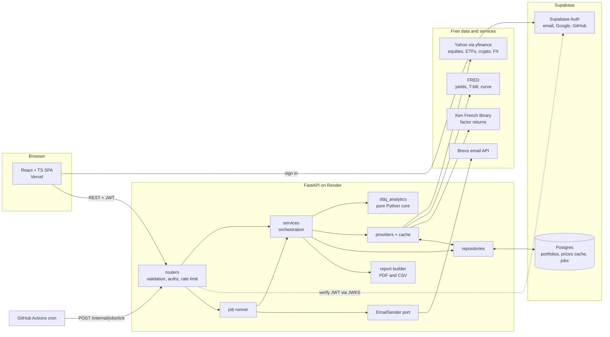

# Architecture

DDQ Portfolio Dashboard is a React single-page app backed by a FastAPI service and a Postgres database. All portfolio maths lives in a standalone Python package that knows nothing about the web layer. The full plan is in [PLAN.md](PLAN.md); decisions are recorded in the ADRs below.

Phase 0 implements the walking skeleton: the SPA, the API's routers, middleware and database connection, and the deploy pipeline. The remaining boxes arrive in later phases.

## Dependency rule

`routers → services → {analytics, providers, repositories}`. `ddq_analytics` imports nothing from `apps/` and no web, database or network library; an import-linter contract in CI enforces it.

## Request flow (dashboard load, from Phase 2)

The router validates and authorizes the request. The service loads holdings, and the providers return aligned prices from the Postgres cache, fetching from the source only on a miss or a stale entry. The service builds the returns matrix, `ddq_analytics` computes, and the service caches the result keyed by portfolio version, parameters and a data snapshot hash before returning the envelope.

## Middleware order (outermost first)

| Layer | Purpose |
|-------|---------|
| Request context | Correlation id (`X-Request-ID`), JSON access log without query strings |
| Security headers | `nosniff`, frame denial, `no-store`, HSTS in production |
| CORS | Exact-origin allowlist, no credentials |
| Rate limit | Per-client fixed window; sits inside CORS so a 429 is readable by the browser |
| Body size limit | Rejects oversized and unsized (chunked) bodies |

## Decisions

- [ADR 0001: Supabase Auth](adr/0001-supabase-auth.md)
- [ADR 0002: Render for the API](adr/0002-render-for-the-api.md)
- [ADR 0003: Postgres job queue](adr/0003-postgres-job-queue.md)
- [ADR 0004: Brevo behind a port](adr/0004-brevo-email-behind-a-port.md)
- [ADR 0005: ECharts](adr/0005-echarts.md)
- [ADR 0006: API is the only DB client](adr/0006-api-is-the-only-db-client.md)
- [ADR 0007: ReportLab for PDF](adr/0007-reportlab-for-pdf.md)
- [ADR 0008: Lean runtime dependencies](adr/0008-lean-runtime-dependencies.md)
- [ADR 0009: Contract-first types](adr/0009-contract-first-types.md)
- [ADR 0010: Monorepo with uv and pnpm](adr/0010-monorepo-uv-and-pnpm.md)
- [ADR 0011: In-process rate limiting](adr/0011-in-process-rate-limiting.md)
